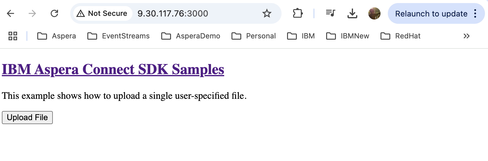
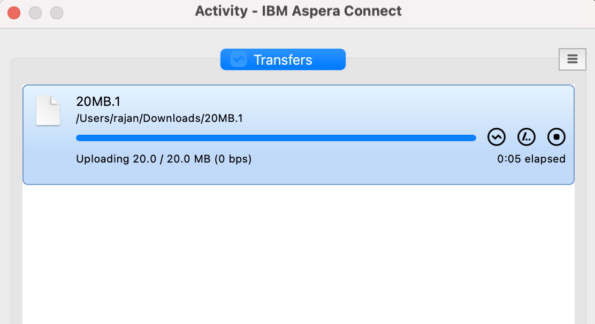

# Integrating Aspera High Speed Transfers into your Web Application

Aspera provides different types of API options to integrate with your web applications.
There are already documents and references available that explain this in depth.
The purpose of this document is to provide a simplified step-by-step guide for integrating Aspera HSTS with your Web Application using Aspera Node API in javascript.

## References
1. [https://github.com/laurent-martin/aspera-api-examples](https://github.com/laurent-martin/aspera-api-examples)   
2. [https://developer.ibm.com/apis/catalog/aspera--aspera-node-api/Introduction](https://developer.ibm.com/apis/catalog/aspera--aspera-node-api/Introduction)
3. [https://github.com/IBM/aspera-connect-sdk-js](https://github.com/IBM/aspera-connect-sdk-js)
4. [https://community.ibm.com/community/user/integration/viewdocument/setting-up-hsts-for-nodeapi?CommunityKey=6f5c7fb2-9873-40ee-8d3e-b0f02f50d0e9&tab=librarydocuments](https://community.ibm.com/community/user/integration/viewdocument/setting-up-hsts-for-nodeapi?CommunityKey=6f5c7fb2-9873-40ee-8d3e-b0f02f50d0e9&tab=librarydocuments)

## Setting Up the Development Environment
I will be showing javascript based example in this guide. So, it is needed to have a javascript development environment (e.g. nodejs). If you do not have one, you can get one setup quickly with these instruction (Linux environment). If you already have one - skip this section.    

    Install nodejs and npm
    yum install nodejs npm
    npm install -g serve   
    Check:  
    node --version
    npm --version

## Setting Up HSTS for Web App Connection.

1. First We need to create a Transfer User and setup the Transfer User for Node API access. We will also define a folder where the files uploaded via the web app should be stored.      
Refer to [4] (Step 1) for complete steps to do this.    

2. Next create a NodeAPI user and associate it with the Transfer User.    
Refer to [4] (Step 2) for complete steps to do this.    

3. Create Access Keys that will be used by the web app to connect to the HSTS.   
Refer to [4] (Step 3) for complete steps to do this.    

4. Create a Basic Auth token from your access key and secret. [The integration supports Basic Auth and Bearer Auth. For this guide we will use Basic Auth]     

        echo -n 'access-key:secret' | base64   

## Setup Aspera Connect SDK

1. Refer to [3] to install the Aspera Connect SDK. You can install from npm or using the source.  

        Example installing from Source.
        Create a local work folder.   
        mkdir /opt/software/myapp
        git clone https://github.com/IBM/aspera-connect-sdk-js.git

        Install / Run the sample app. 
        cd /opt/software/myapp/aspera-connect-sdk-js/
        npm install
        npm run build

2. Replace the index.html and index.js files in the examples/upload folder with the files in this github.   
[index.html](./index.html)   
[index.js](./index.js)   

3. At minimum, update the index.js file with the following details:  

        The URL of the Aspera Node
        The Basic Auth Token

4. Serve the new application. 

        cd /opt/software/myapp/aspera-connect-sdk-js/examples/upload
        serve -s
5. Open the web application and test upload. 

        Open http://<Local Web App URL>:3000
        Click on Upload and try transferring file. 

  

  

6. File should be uploaded to the folder in HSTS.    
Check if the file has been uploaded in the HSTS.   

        ls -lta /data/webapp_data/

